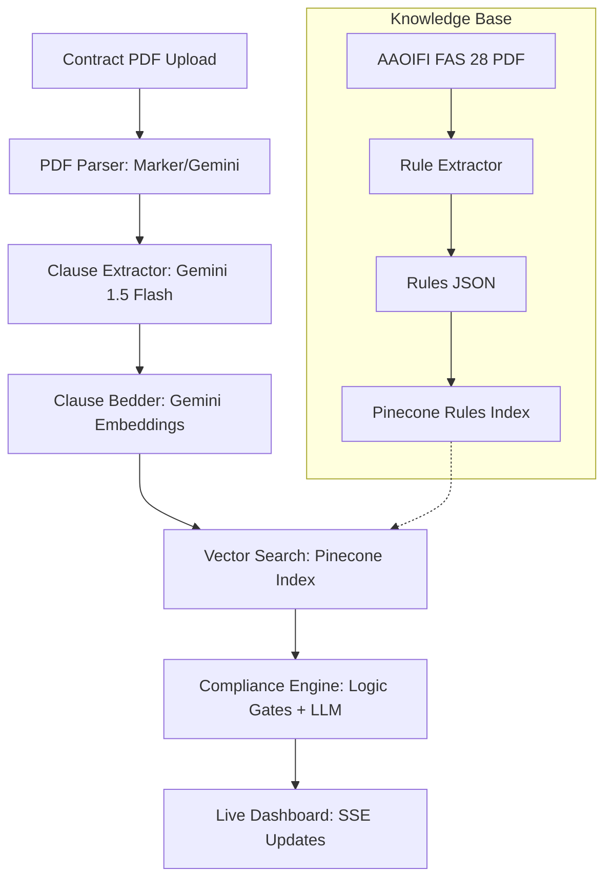

# System Architecture

## PDF Ingestion & Analysis Flow

## Data Lifecycle

| Phase | Technology | Output |
| :--- | :--- | :--- |
| **Parsing** | Marker / PyMuPDF4LLM | Structured Markdown |
| **Decomposition** | Gemini 1.5 Flash | List of Semantic Clauses |
| **Retrieval** | Pinecone + text-embedding-004 | Top-k AAOIFI Rules |
| **Reasoning** | Gemini 1.5 Pro | Explanation + Verdict |
| **Delivery** | FastAPI (SSE) | React Table Update |

## Design Identity
The system will use a **Premium Glassmorphic** UI with an academic yet high-tech feel:
* **Palette**: Deep Charcoal, Vibrant Emerald (#10B981), and Gold Accents.
* **Typography**: Inter (UI) and Playfair Display (Headings).
